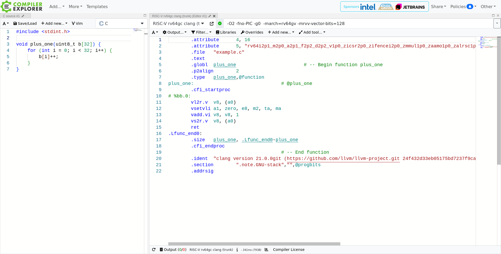

# GHC's RISC-V Native Code Generation Backend

- Haskell Implementors' Workshop 2025
- Sven Tennie

---
layout: section
color: sky
align: c
---

# RISC-V Overview

---
layout: top-title
align: c
color: light
---

:: title ::

# RISC-V

:: content ::

- 32bit **R**educed **I**nstruction **S**et as base
  - RV32I *Base Integer Instruction Set* -> ~40 instructions, ~6 formats
  - Basic interpreter can be built in an afternoon
- Augmented by many extensions (sub-standards)
  - ISA like playing with Lego bricks
- Custom extensions are anticipated by the ISA
- Ideal research vehicle for computer architectures

---
layout: top-title
align: c
color: light
---

:: title ::

# RISC-V

:: content ::

- **ISA is open source**, implementations (SOCs) not necessarily
  - License: _Creative Commons Attribution 4.0 International_
  - Development on GitHub
  - Vibrant community
  - Conceptualization in working groups at _RISC-V International_ foundation
    - Free membership for individuals
- Everyone is free to build a RISC-V processor:
  - Several vendors
  - Hobbyists
    - Fun fact: Some even tape out their designs via e.g. tinytapeout.com
---
layout: top-title
align: c
color: light
---

:: title ::

# RISC-V Status

:: content ::

- Standard (ISA, Calling Convention, ...) pretty complete
- Lack of powerful hardware
  - No good cloud options -> No native cloud CI
  - Cores comparable to ARM A55 (2017)
    - Your smartphone might be more powerful than RISC-V SBCs

---
layout: top-title
align: c
color: light
---

:: title ::

# RISC-V Status

:: content ::

- Lot's of movement though
  - New boards and chips appear frequently
  - Many manufacturers
  - Research all over the world
    - EU grant for RISC-V HPC research
      - DARE (Digital Autonomy with RISC-V in Europe)
      - Funding: ~240 Million Euros
    - SHAKTI by IIT-Madras (India)
    - many more

---
layout: top-title
align: c
color: light
---

:: title ::

# RISC-V Status

:: content ::

- There are still some dragons ...
  - Tools don't support the full instruction set
  - Tools sometimes still have bugs ...
  - Cores may have bugs
  - Core may not adhere to the ratified standards because it pre-dates it

<AdmonitionType type="warning">
Use latest releases and be very precise about the hardware and build target!
</AdmonitionType>

---
layout: top-title
align: c
color: light
---

:: title ::

# ISA naming scheme

:: content ::

- Start with a base ISA: RV32I, RV64I or RV64E
- Add the extensions in canonical order
  - RV64I**M** (*Extension for Integer Multiplication and Division*)
- Extensions can imply others
  - F (*Extension for Single-Precision Floating-Point*) implies Zicsr (*Extension for Control and Status Register
(CSR) Instructions*)
- Extension can be versioned
  - Format:  `<extension><major>p<minor>` (parts can be optional)
  - The ISA is pretty new, so extensions' versions can usually be ignored
- Reduce common extensions to sets (e.g. *G*eneral for _IMAFDZicsr_Zifencei_)
  - `RV64IMAFDZicsr_ZifenceiV1p0` -> `RV64GV1p0` -> `RV64GV1` -> `RV64GV`

---
layout: top-title
align: c
color: light
---

:: title ::
# Profiles

:: content ::

- _Profiles_ (e.g. RVA23) define minimum requirements to simplify this
  - Otherwise, buying and building for a consumer computer could be a nightmare
  - (It still is, because many vendors don't mention profiles yet on their marketing pages)
  - Linux distributions handle this by relying on a small extension set (usually _RV64GC_)
    - *G*: General
    - *C*: Compressed instructions

---
layout: section
color: sky
align: c
---

# GHC Implementation Status


---
layout: top-title
align: c
color: light
---

:: title ::


# GHC RISC-V History

:: content ::

- LLVM backend by Andreas Schwab (October 2020; GHC 9.2)
- Moritz Angerman and Sven Tennie accidentally started NCG at the same time

  - Moritz switched to mentor role
  - Sven continued to hack
  - Andreas built CI support at SuSE with patch files
  - Available from GHC 9.12

<AdmonitionType type="tip">
<b>Reach out and team up</b>
  <ul>
  <li>I wouldn't have imagined that such great collaboration between former strangers would be possible.</li>
  <li>It is!</li>
  </ul>
</AdmonitionType>

---
layout: top-title
align: c
color: light
---

:: title ::

# GHC RISC-V status

:: content ::

- LLVM Backend
- RTS Linker
- Native Code Generation Backend
  - Fullfills whole testsuite (minus SIMD tests)
- Tier 3 platform
  - Due to lack of powerful hardware (CI), there are no official binary distributions, yet
  - Probably not much used yet
    - Happy to receive bug reports!
- SIMD (Vector) in NCG support WIP

---
layout: section
color: sky
align: c
---

# Vector (SIMD) Support

---
layout: top-title
align: c
color: light
---

:: title ::

# Vector Register Configuration

:: content ::

- Problem: Applications need very different vector sizes

  - Embedded chips should save silicon
  - HPC may need big vectors
  - usually a tradeoff
  - usually max vector sizes are bound to ISA features
  - Standard allows 32 (*Zvl32b*) to 65,536 bits per vector register

---
layout: top-title
align: c
color: light
---

:: title ::

# Vector Register Configuration

:: content ::

- RISC-V approach:

  1. Make effective register width configurable -> **grouping**
      - Combine multiple vector registers to one effective
  2. Tell when a configuration doesn't fit -> **strip mining**
      - Iterate over vector chunks

- Benefits:
  - Application can dynamically react on the vector register width (VLEN)
  - HPC software can run on embedded CPUs and vice versa without recompilation

---
layout: top-title
align: c
color: light
---

:: title ::

# Vector Register Configuration Instruction(s)

:: content ::

`vsetivli <VL>, <AVL>, <SEW>, <LMUL>, <tail>, <mask>`

- `VL`: New, effective **V**ector **L**ength (in elements)
- `AVL`: **A**pplication **V**ector **L**ength
  - The desired VL
- `SEW`: **S**ingle **E**lement **W**idth
  - Width of an element: `e8`, `e16`, `e32`, `e64` (bits)
- `LMUL`: **L**ength **Mul**tiplier
  - `mf8` (LMUL=1/8), `mf4` (LMUL=1/4), `mf2` (LMUL=1/2)
  - `m1` (LMUL=1), `m2` (LMUL=2), `m4` (LMUL=4), `m8` (LMUL=8)

---
layout: two-cols-title
columns: is-6
---

:: title ::

# Vector configuration - Grouping

- Increment each element of a _8bit x 8_ vector by one (128bit register width)


:: left ::

```c
void plus_one(uint8_t b[8]) {
    for(int i = 0; i < 8; i++) {
        b[i]++;
    }
}
```

- `mf2` grouping: 1/2 * 128 = 64
- required bits: 8 * 8 = 64


:: right ::

```asm
plus_one:
        vsetivli zero, 8, e8, mf2, ta, ma
        # Load v8 as 8-bit elements at address in a0
        vle8.v v8, (a0)
        # v8[i] = v8[i] + 1
        vadd.vi v8, v8, 1
        # Store to address in a0
        vse8.v v8, (a0)
        ret
```

<!-- https://godbolt.org/z/dGfxY7dv3 -->

---
layout: two-cols-title
columns: is-6
---

:: title ::
# Vector configuration - Grouping (2)

- Increment each element of a _8bit x 16_ vector by one (128bit register width)

:: left ::

```c
void plus_one(uint8_t b[16]) {
    for(int i = 0; i < 16; i++) {
        b[i]++;
    }
}
```

- `m1` grouping: 1 * 128 = 128
- required bits: 8 * 16 = 128


:: right ::

```asm
plus_one:
        vsetivli zero, 16, e8, m1, ta, ma
        # Load v8 as 8-bit elements at address in a0
        vle8.v v8, (a0)
        # v8[i] = v8[i] + 1
        vadd.vi v8, v8, 1
        # Store to address in a0
        vse8.v v8, (a0)
        ret
```

<!-- https://godbolt.org/z/jWGvWsbE4 -->

---
layout: two-cols-title
columns: is-6
---

:: title ::

# Vector configuration - Grouping (3)

- Increment each element of a _8bit x 32_ vector by one (128bit register width)

:: left ::

```c
void plus_one(uint8_t b[32]) {
    for(int i = 0; i < 32; i++) {
        b[i]++;
    }
}
```

- `m2` grouping: 2 * 128 = 256
- required bits: 8 * 32 = 256

:: right ::

```asm
plus_one:
        # 32 doesn't fit into an immediate, use a register
        li a1, 32
        vsetvli zero, a1, e8, m2, ta, ma
        # Load v8 as 8-bit elements at address in a0
        vle8.v v8, (a0)
        # v8[i] = v8[i] + 1
        vadd.vi v8, v8, 1
        # Store to address in a0
        vse8.v v8, (a0)
        ret
```

<!-- https://godbolt.org/z/bjr57ohsr -->

<!-- https://llvm.org/devmtg/2023-10/slides/techtalks/Lau-VectorCodegenInTheRISC-VBackend.pdf -->

---
layout: two-cols-title
columns: is-6
---

:: title ::

# Vector configuration - Strip-Mining

- Increment each element of a _8bit x 32_ vector by one (128bit register width)

:: left ::
```c
void plus_one(uint8_t b[32]) {
    for(int i = 0; i < 32; i++) {
        b[i]++;
    }
}
```

- Iterations (after `vsetvli`):
  1. `t0` = 16; `a1` = 32; `a0` = `&b[0]` = `b`
  1. `t0` = 16; `a1` = 16; `a0` = `&b[16]` = `b + 16`

:: right ::

```asm
plus_one:
        # Start with 32 elements
        li a1, 32
loop:
        # Configure to get the real VL (16) in t0
        vsetvli t0, a1, e8, m1, ta, ma
        # Perform computation on chunk
        vle8.v v8, (a0)
        vadd.vi v8, v8, 1
        vse8.v v8, (a0)
        # Update pointers and counters for next chunk
        # Move pointer forward: a0 += VL
        add a0, a0, t0
        # Reduce remaining elements (a1 -= VL)
        sub a1, a1, t0
        # Repeat if there are remaining elements
        bnez a1, loop
end:
        ret
```

---
layout: two-cols-title
columns: is-6
---

:: title ::

# Vector configuration - Strip-Mining

- Increment each element of a _8bit x **17**_ vector by one (128bit register width)

:: left ::
```c
void plus_one(uint8_t b[17]) {
    for(int i = 0; i < 17; i++) {
        b[i]++;
    }
}
```

- Iterations (after `vsetvli`):
  1. `t0` = 16; `a1` = 17; `a0` = `&b[0]` = `b`
  1. `t0` = 1; `a1` = 1; `a0` = `&b[16]` = `b + 16`

:: right ::

```asm
plus_one:
        # Start with 17 elements
        li a1, 17
loop:
        # Configure to get the real VL in t0
        vsetvli t0, a1, e8, m1, ta, ma
        # Perform computation on chunk
        vle8.v v8, (a0)
        vadd.vi v8, v8, 1
        vse8.v v8, (a0)
        # Update pointers and counters for next chunk
        # Move pointer forward: a0 += VL
        add a0, a0, t0
        # Reduce remaining elements (a1 -= VL)
        sub a1, a1, t0
        # Repeat if there are remaining elements
        bnez a1, loop
end:
        ret
```


---
layout: top-title
align: c
color: light
---

:: title ::


# Vectors: Questions to investigate

:: content ::

- How can we allocate register groups? (Virtual registers that cover multiple consecutive registers)
  - This would require the register allocator to be aware of grouped registers
- Would it be better to apply strip-mining?
  - Would that work for all `MachOp`s?
- How to optimize for minimal vector re-configuration?
  - My naive approach is to:
    - fold over the final instructions in the Assembly emitting stage (`Ppr.hs`)
    - drop duplicated configuration statements in a block
  - This ignores optimizations by moving instructions with the same configuration.

---
layout: section
color: sky
---

# NCG development: Tipps & Tricks

---
layout: top-title-two-cols
columns: is-4
color: light
---

:: title ::


# Compiler Explorer (Godbolt)

:: left ::

- https://godbolt.org
- Learn from others
- C and LLVM IR are good choices
- Intrinsics are a typed way to play with Assembly

:: right ::


---
layout: top-title
align: c
color: light
---

:: title ::

# ghc.nix

:: content ::

- https://gitlab.haskell.org/ghc/ghc.nix
- Nix env to build GHC
  - Cross-compiler envs possible

```sh
cd $MY_GHC_SRC_DIR
nix develop "git+https://gitlab.haskell.org/ghc/ghc.nix#riscv64-linux-cross"
./boot && configure_ghc
```

- More convenient with `direnv` `.envrc` file
  - `direnv` automatically provides the environment when you change into the directory

```sh
use flake git+https://gitlab.haskell.org/ghc/ghc.nix\#riscv64-linux-cross
```


---
layout: top-title
align: c
color: light
---

:: title ::

# Run test cross with Qemu

:: content ::

- Most tests can be executed with an emulator (e.g. Qemu)
  - You don't have access to real hardware
  - Your workstation is faster
  - ...

```sh
CROSS_EMULATOR=qemu-riscv64 hadrian/build -j --docs=none --flavour=devel2 test
```

---
layout: top-title
align: c
color: light
---

:: title ::

# test-primops

:: content ::

- https://gitlab.haskell.org/ghc/test-primops
- QuickCheck tests for PrimOps
- Compares your GHC to another version
  - Cross possible

---
layout: top-title
align: c
color: light
---

:: title ::

# Build Compiler with LLVM

:: content ::

- Focus on small bits: One at a time
- Build GHC itself and libraries with `-fllvm`
- Build tests with `-fasm`
  - ```sh
    EXTRA_HC_OPTS=-fasm hadrian/build test ...
    ```
- `hadrian` provides:
  - a flavour transformer `<your-flavour>+llvm`
  - a flavour that uses LLVM `quick-cross`

---
layout: top-title
align: c
color: light
---

:: title ::

# Reduce problems

:: content ::

- Adjust tests
  - Focus on one test / feature at a time
  - Build the smallest reproducer possible
  - Reading a lot of Assembly or Cmm can be very exhausting
  - Add dump options: `-ddump-to-file -dppr-debug -ddump-cmm -ddump-asm`
    - Run `hadrian` with `-k` to *k*eep those files
  - Write small Cmm reproducers by hand
    - E.g. write a small Haskell driver and call it via FFI
- Run testsuite subsets with `hadrian`
  - `--only="test1 test2"` or `--test-root-dirs="./testsuite/tests/..."`
---
layout: top-title
align: c
color: light
---

:: title ::

# Your are not alone!

:: content ::

- Matrix group (with IRC bridge): https://matrix.to/#/#GHC:matrix.org
- Mailing list: https://mail.haskell.org/cgi-bin/mailman/listinfo/ghc-devs
- Discourse: https://discourse.haskell.org

---
layout: top-title
align: c
color: light
---

:: title ::

# Hunting Heisenbugs

:: content ::

- Bugs that disappear when you "look" at them
  - Trace logs and debuggers (GDB) change the timing of programs and execution at CPU-level
- Trace instructions and/or CPU state with Qemu
  - `qemu-riscv64 -d in_asm,cpu -one-insn-per-tb`
- My worst Heisenbug was a missing memory barrier (program cache flush, `fence.i` instruction) in the linker
  - Illegal instruction exceptions at weird places
  - Gone when the timing changed e.g. by adding trace logs
  - Staring at Qemu traces gives hints what happened shortly before
    - Though, it slows the execution down immensely!

---
